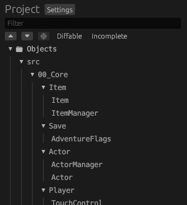
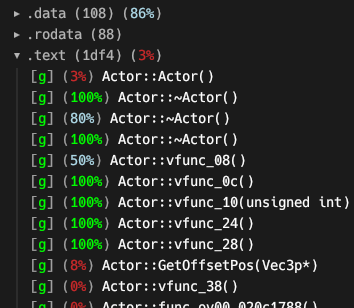
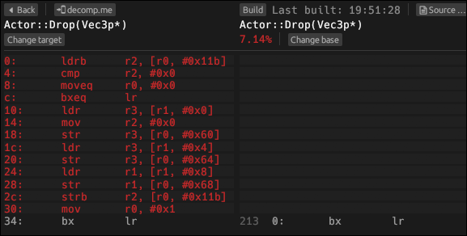
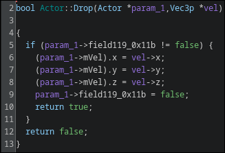
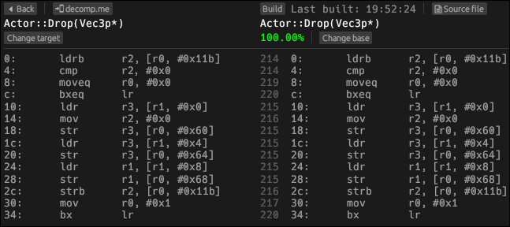

# Decompiling
This document describes how you can start decompiling code and contribute to the project. Feel free to ask for help if you get
stuck or need assistance.
- [Pick a source file](#pick-a-source-file)
- [Decompiling a source file](#decompiling-a-source-file)
- [Decompiling a function](#decompiling-a-function)
- [Decompiling `.init` functions](#decompiling-init-functions)
- [The Ghidra project](#the-ghidra-project)

## Pick a source file
For actors and map objects, a reservation sheet exists for a list of delinked source files that are ready to be decompiled. This list grows as more source files are delinked from the rest of the base ROM. You can request access to the sheet in the ZeldaRET discord [channels for ST](https://discord.com/channels/688807550715560050/1453177153502969977) (you can join the server with [this invite link](https://discord.gg/6tjntnU8hC)).

You can claim a source file (called an "actor") by changing its state to "reserved" in the "Reserved by" column. Once you started decompilation, create a PR on the ST repository for the actor you're decompiling. The decomp-dev bot will follow your PR and give information about the decompilation progress of your code.

If you want to unclaim the file, leave a comment your the PR and mark the actor as "available" on the reservation sheet so we can be certain that the source file is available to be claimed again.
Remember to make a pull request of any progress you made on the source file, whether it is just header files or partially decompiled code.

> [!NOTE]
> If you want to decompile a non-actor file, instead of filling an entry in the spreadsheet, open [an issue](https://github.com/zeldaret/st/issues) for it on top of the PR and mark it with appropriate labels ("decomp", "reserved", etc). You can find a detailed list of the labels [on github](https://github.com/zeldaret/st/labels).

## Decompiling a source file
We use the object diffing tool [`objdiff`](https://github.com/encounter/objdiff) to track differences between our decompiled C++ code and the base ROM's code.
1. [Download the latest release.](https://github.com/encounter/objdiff/releases/latest)
1. Run `configure.py [--version|-v <eur|jp>]` and `ninja` to generate `objdiff.json` in the repository root (don't forget to follow the instructions in [INSTALL.md](../INSTALL.md) first). Note: if `--version` isn't passed the project will be configured to use all supported versions (meaning all versions will be showed on objdiff.
1. In `objdiff`, set the project directory to the repository root (it should load `objdiff.json` itself).
   - [WSL only] If you're using WSL (which is possible to do, although a few things may not work), navigate to the project directory with window's directory picker tool and select it. Do not set the path manually unless you know what you're doing, `objdiff` may use different path format over time.
1. Select your source file in the left sidebar:  

1. See the list of functions and data to decompile:  


The following sections explain how to decompile the different parts you see in `objdiff`.

> [!NOTE]
> If a source file is missing in `objdiff`, or `objdiff` fails to build a file, first rerun `ninja` to update `objdiff.json`.
> You can see more details on a `objdiff` error by looking for a context window called "Jobs" at the top of the window (hoverring on the red text should show a full description of the run command and the error).
> If the problem persists, feel free to ask for help.

## Decompiling a function
Once you've opened a source file in `objdiff`, you can choose to decompile the functions in any order. We recommend starting
with a small function if you're unfamiliar with decompilation. Here's an example:



As a starting point, we look at the decompiler output in Ghidra. You can request access to our shared Ghidra project [in this section](#the-ghidra-project).



Looking at this output, we might try writing something like this:
```cpp
bool Actor::Drop(Vec3p *vel) {
    if (mGrabbed) {
        mVel     = *vel;
        mGrabbed = false;
        return true;
    }
    return false;
}
```

Now we can go back to `objdiff` and look at the result:



Success! Note that this was a simple example and that you'll sometimes get stuck on a function. In that case, try the
following:
- Decompile a different function and come back later.
- Export to [decomp.me](https://decomp.me/):
    1. Press the `decomp.me` button in `objdiff`.
    1. Paste your code into the "Source code" tab. The whole file may be needed to access defined globals.
    1. On `decomp.me`, switch to the `objdiff` tab, you can check that you see what was expected from your local diff.
    1. Share the link with us! (Reminder [link to the ZeldaRET discord server](https://discord.gg/6tjntnU8hC).)

> [!Note]
> If the function is using THUMB mode you can use `THUMB_BEGIN` and `THUMB_END` before and after the function to create a THUMB region, anything outside of the region will use ARM.  
> If you have inlines in a header and `#include` the header outside of the region it will use ARM. But if you include it inside the thumb region it will use thumb.

## Decompiling `.init` functions
> [!NOTE]
> This section will be updated as we learn more about global objects. Feel free to contribute or provide us with more information!

Functions in the `.init` section are static initializers. Their purpose is to call C++ constructors on global objects, and to
register destructors so the global objects can be destroyed when their overlay unloads.

Static initializers are generated implicitly and do not require us to write any code ourselves. So, to generate one, you must
define a global variable by using a constructor.

If the static initializer calls `__register_global_object`, that means the global object has a destructor. This means you'll
have to declare a destructor if it doesn't exist already.

Another consequence of having a destructor is that a `DestructorChain` object will be added to the `.bss` section. This struct
is 12 (`0xc`) bytes long and is also implicit, so we don't need to define it ourselves.

> [!IMPORTANT]
> An important thing to keep in mind is that a static initializer can construct multiple global objects.

## Decompiling data
> [!NOTE]
> Under construction! It's not fully clear how data is decompiled, as the compiler is strict on how it orders global variables.
> Feel free to contribute to this section or provide us with more information!

Other than `.text` and `.init` which contain code, there are the following sections for data:
- `.rodata`: Global or static constants (requires `const`)
- `.data`: Global or static variables (requires not using `const` except if it's used in a static initializer, in which case all of the data will be set to zero)
- `.bss`: Global or static uninitialized variables

You can see examples of these data sections in the [compilation section in `build_system.md`](/docs/build_system.md#compiling-code).

## The Ghidra project
We use a shared Ghidra project to analyze the game and decompile functions. To gain access to the project, install
[Ghidra version 11.2.1](https://github.com/NationalSecurityAgency/ghidra/releases/tag/Ghidra_11.2.1_build) and request access
from @aetias on Discord.