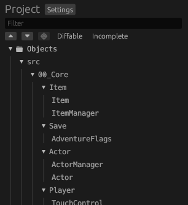
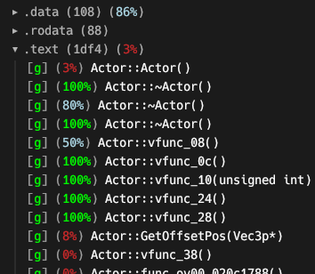
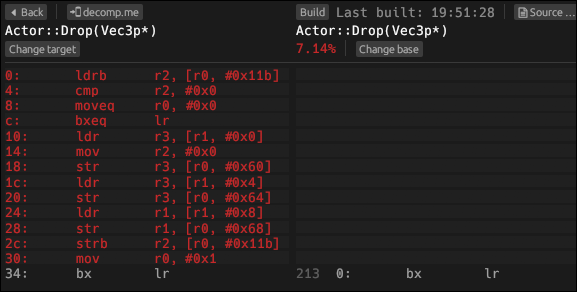
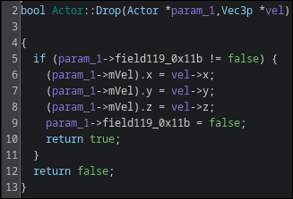
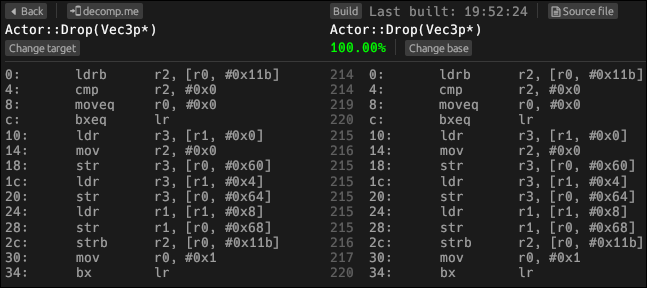
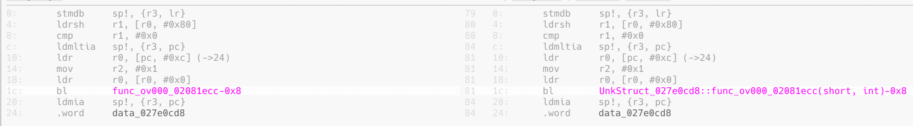
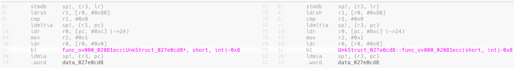
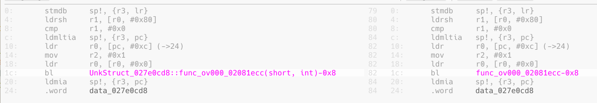
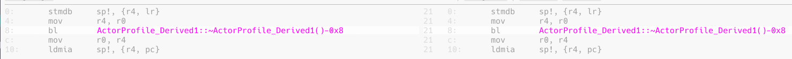

# Decompiling
This document describes how you can start decompiling code and contribute to the project. Feel free to ask for help if you get
stuck or need assistance.
- [Pick a source file](#pick-a-source-file)
- [Decompiling a source file](#decompiling-a-source-file)
- [Decompiling a function](#decompiling-a-function)
- [Decompiling `.init` functions](#decompiling-init-functions)
- [About symbols](#about-symbols)
- [The Ghidra project](#the-ghidra-project)

[tips.md](tips.md) has extra information that is not required to get started, but may help you get familiar with the project's code. Check it out when needed!

## Pick a source file
For actors and map objects, a reservation sheet exists for a list of delinked source files that are ready to be decompiled. This list grows as more source files are delinked from the rest of the base ROM. You can request access to the sheet in the ZeldaRET discord [channels for ST](https://discord.com/channels/688807550715560050/1453177153502969977) (you can join the server with [this invite link](https://discord.gg/6tjntnU8hC)).

You can claim a source file (called an "actor"[^1]) by changing its state to "reserved" in the "Reserved by" column. Once you started decompilation, create a PR on the ST repository for the actor you're decompiling. The decomp-dev bot will follow your PR and give information about the decompilation progress of your code.

[^1]: That is, for most usual files, a non-actor code file can be a Map Object for example.

If you want to unclaim the file, leave a comment your the PR and mark the actor as "available" on the reservation sheet so we can be certain that the source file is available to be claimed again.
Remember to make a pull request of any progress you made on the source file, whether it is just header files or partially decompiled code, and mark it as ready so that it can be registered by other members.

> [!NOTE]
> If you want to decompile a non-actor file, instead of filling an entry in the spreadsheet, open [an issue](https://github.com/zeldaret/st/issues) for it on top of the PR and mark it with appropriate labels ("decomp", "reserved", etc). You can find a detailed list of the labels [on github](https://github.com/zeldaret/st/labels). For more details visit the discord channel for ST.

## Decompiling a source file
We use the object diffing tool [`objdiff`](https://github.com/encounter/objdiff) to track differences between our decompiled C++ code and the base ROM's code. [`ghidra`](https://github.com/NationalSecurityAgency/ghidra) is a popular software for decompiling and is the one used in this project. You can use any tool you're familiar with, but these are the ones used by other members and the ones we'll be able to provide help with.

1. Download the latest releases: [`objdiff`](https://github.com/encounter/objdiff/releases/latest), [`ghidra`](https://github.com/NationalSecurityAgency/ghidra/releases/latest) (only `objdiff` is needed in this section).
1. Run `tools/configure.py [--version|-v <eur|jp>]` and `ninja` to generate `objdiff.json` in the repository root (don't forget to follow the instructions in [INSTALL.md](../INSTALL.md) first). Note: if `--version` isn't passed the project will be configured to use all supported versions (meaning all versions will be showed on objdiff).
1. Open `objdiff`. There, set the project directory to the repository root (it should load `objdiff.json` itself, if present in the directory, it should have been generated at the previous step).
   - [WSL only] If you're using WSL (which is possible to do, although a few things may not work perfectly), navigate to the project directory with window's directory picker tool and select it. Do not type the path manually unless you know what you're doing, `objdiff` may use different path format over time.
1. Select your source file in the left sidebar:  
An example can be `src/000_Second/Actor/Actor`[^objdiff_src_path]  

1. See the list of functions and data to decompile:  


[^objdiff_src_path]: This path was valid when this doc was written, the project structure may have changed since.

The following sections explain how to decompile the different parts you see in `objdiff`.

> [!NOTE]
> If a source file is missing in `objdiff`, or `objdiff` fails to build a file, first rerun `ninja` to update `objdiff.json` (you can run `ninja objdiff` to only re-generate the `objdiff.json` file).
> You can see more details on an `objdiff` error by looking for a context window called "Jobs" at the top of the window (hoverring on the red text should show a full description of the run command and the error).
> If the problem persists, feel free to ask for help.

## Decompiling a function
Once you've opened a source file in `objdiff`, you can choose to decompile the functions in any order. We recommend starting
with a small function if you're unfamiliar with decompilation. Here's an example:



As a starting point, we look at the decompiler output in `ghidra` (search for the function name there first, if you don't find it [see common tips](tips.md#finding-a-function-in-ghidra)). You can request access to our shared `ghidra` project [in this section](#the-ghidra-project), it will provide you with prepared files for decompilation and avoid having to setup ghidra yourself. \
We get this code from ghidra (in the rightmost window):



Looking at this output, we might try writing something like this:
```cpp
bool Actor::Drop(Vec3p *vel) {
    if (mGrabbed) {
        mVel     = *vel; // Vec3p struct copy
        mGrabbed = false;
        return true;
    }
    return false;
}
```

Now we can go back to `objdiff` and look at the result:



Success! Note that this was a simple example and that you'll sometimes get stuck on a function. In that case, try the
following:
- Decompile a different function and come back later.
- Export to [decomp.me](https://decomp.me/):
    1. Press the `decomp.me` button in `objdiff`.
    1. Paste your code into the "Source code" tab. The whole file may be needed to access defined globals.
    1. On `decomp.me`, switch to the `objdiff` tab[^2], you can check that you see what was expected from your local diff.
    1. Share the link with us! (Reminder [link to the ZeldaRET discord server](https://discord.gg/6tjntnU8hC).)

[^2]: You can set this as the default in `decomp.me` settings.

> [!Note]
> If the function is using THUMB mode you can use `THUMB_BEGIN` and `THUMB_END` before and after the function to create a THUMB region, anything outside of the region will use ARM.  
> If you have inlines in a header and `#include` the header outside of the region it will use ARM. But if you include it inside the thumb region it will use thumb.

## Decompiling `.init` functions
> [!NOTE]
> This section will be updated as we learn more about global objects. Feel free to contribute or provide us with more information!

Functions in the `.init` section are static initializers. Their purpose is to call C++ constructors on global objects, and to
register destructors so the global objects can be destroyed when their overlay unloads.

Static initializers are generated implicitly and do not require us to write any code ourselves. So, to generate one, you must
define a global variable by using a constructor.

If the static initializer calls `__register_global_object`, that means the global object has a destructor. This means you'll
have to declare a destructor if it doesn't exist already.

Another consequence of having a destructor is that a `DestructorChain` object will be added to the `.bss` section. This struct
is 12 (`0xc`) bytes long and is also implicit, so we don't need to define it ourselves.

> [!IMPORTANT]
> An important thing to keep in mind is that a static initializer can construct multiple global objects.

## Decompiling data
> [!NOTE]
> Under construction! It's not fully clear how data is decompiled, as the compiler is strict on how it orders global variables.
> Feel free to contribute to this section or provide us with more information!

Other than `.text` and `.init` which contain code, there are the following sections for data:
- `.rodata`: Global or static constants (requires `const`)
- `.data`: Global or static variables (requires not using `const` except if it's used in a static initializer, in which case all of the data will be set to zero)
- `.bss`: Global or static uninitialized variables

You can see examples of these data sections in the [compilation section in `build_system.md`](/docs/build_system.md#compiling-code).

## About symbols

### Updating a symbol

When decompiling function calls or data accesses, their may be discrepancies between what names (more precisely, "symbols") the project currently knows and what is expected to match the original binary. In `objdiff`, such situation can be seen as such:


or


In the first case, the base symbol (on the left) has a default name that was defined when delinking the file.
In the second case, the base symbol has already been renamed before, but the name must change again since more context is known (this is less frequent but still happens). \
In both cases, the base symbol can be renamed to the new one by editing the appropriate `symbols.txt` file. There is one of these files per overlay, in this case it's overlay `000` as we can see in the function's name. You can find them under `config/<version>/arm9/overlays/ov<number>/symbols.txt`. \
There, search for the symbol, either with its full name (might not always work), with its address [^3] or its mangled name.

[^3]: It is visible for symbols that do not yet have a meaningful name, in the examples above `02081ecc` is the address of the function.

You can get a symbol's mangled name in `objdiff` by right clicking it's name. In this example, the second line (starting with `_ZN18`) corresponds to the mangled name of the symbol.


Once you found the symbol to be renamed, copy the new mangled name (from `objdiff`, as explained just above) and replace the current symbol in `symbols.txt` by the new one. The symbol is only the first word of the line in `symbols.txt`, leave the rest of the line unchanged.

After you updated the symbols, you can run `ninja objdiff` to re-generate `objdiff.json` and update `objdiff`'s config. After a short time (on WSL, it can take a while), `objdiff` should update its output and the names should line up as such:


### Already existing symbols

In some other cases, the symbol shown in `objdiff` can have more information than your compiled code:



This usually means that a function/data already exists but hasn't been used in the code. Search for the symbol in source files of the project to see if you missed a struct, class or data definition. \
If you don't find a definition matching the symbol shown in `objdiff`, it may have been wrongly updated before or left after other renames. You can consider renaming it if you're sure that the existing symbol is wrong. In any case, feel free to ask for help on the discord channel to help clear out the situation (see link earlier in this file).

### Already existing symbols with the same visual name

This happens most often with ctors/dtors, because there exist mutiple of them for one class that are only differenced by their mangled name and not their regular name:



In such case, check the symbols mangled names by right-clicking them and determine if a symbol update is needed or if you are using the wrong one.

> [!NOTE]
> Fully matching symbols should never appear in any colorful way in `objdiff`. Color are always used to indicate differences, even if the names match. This section is an example that the difference may not appear at the first glance, but that there is one nevertheless.

## The Ghidra project
We use a shared Ghidra project to analyze the game and decompile functions (for both EUR and JP versions). To gain access to the project, install
[Ghidra version 11.2.1](https://github.com/NationalSecurityAgency/ghidra/releases/tag/Ghidra_11.2.1_build) and request access
from @aetias on Discord.