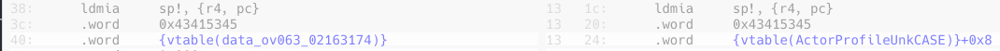
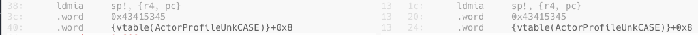
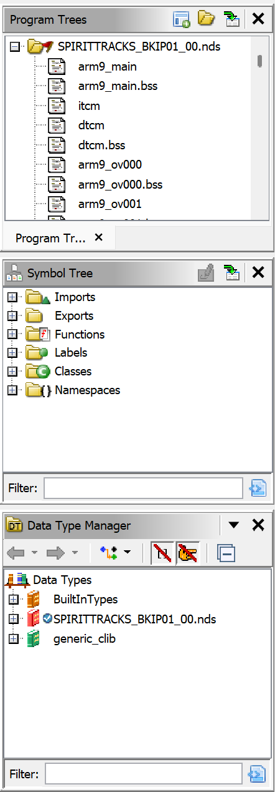

# Tips

Here we gather useful tips that may help to get started with and solve common problems in case of doubt. \
Some miscellaneous information are also reported here, for example about the build rules or the github workflow.

- [Maths](#maths)
  - [General](#general)
  - [Fx32](#fx32)
  - [Angles](#Angles)
  - [Random operations](#random)
- [Symbols](#symbols)
  - [Updating a vtable symbol](#updating-a-vtable-symbol)
- [Ghidra](#ghidra)
  - [Finding a function in Ghidra](#finding-a-function-in-ghidra)
- [Ninja](#ninja)
  - [Build targets](#build-targets)
- [Github](#github)
  - [CI/CD](#cicd)

# Maths

Most of the following information is about types and macros defined in `libs/nitro/include/nitro/math.h`. \
They are important information to efficiently use built in types of the project, and taking a look at that file may be interesting.

## General

There is a `ABS(x)` macro that computes the absolute value of the given value.

## Fx32

`fx32` (and smaller `fx` types) represent **F**ixed **P**oint floats used in the source code. They appear very often, especially with the `VexFx32` struct (3 `fx32`s components that represent a position or other kind of vectors).

Some macros exists to operate on them, two major ones are `FLOAT_TO_FX32(n)` (takes a C `float` and transforms it into a `fx32`) and `MUL_FX32(a, b)` (takes two `fx32` and performs multiplication).

## Angles

There is a `DEG_TO_ANG(n)` macro that converts an angle from degrees to an internal hexadecimal representation.

There are two macros `SIN(n)` and `COS(n)` that compute the expected trigonometric values by doing a table lookup[^sincos]. Note that both macros access the same table, but the kind of operation performed can usually be determined by looking at the lookup pattern:
- for `SIN`, `gSinCosTable` is accessed at roughly `2 * n`;
- for `COS`, `gSinCosTable` is accessed at roughly `2 * n + 1`. The `+1` allows for the differentiation.

[^sincos]: You can usually spot these operations by seing a lookup to the table in ghidra.

`Actor.mAngle` sometime is unexpectedly saved onto the stack when used in function calls. It's default type is `fx16`, but this type usually doesn't lead to the stack save. The member's type is actually an union, also including `mAngleStruct` of type `UnkAngleStruct`, using this type usually solves the stack save pattern.

## Random

Random operations are handled by the `gRandom` class. The most common operation is `gRandom.Next32(u32 factor)`, with `factor=0` being a very common value. \
Such calls can be tricky to find because they are usually inlined, but if you see lots of computations involving `gRandom` and it's members, chances are that it's a `Next32` computation (the argument may vary though, but starting by setting `0` may help to spot the actual `factor` used).

# Symbols

An introduction about symbols is already given in [decompiling.md](decompiling.md#about-symbols), more specific information are available here.

## Updating a vtable symbol

When creating a symbol for a class vtable, you may encounter the following situation:

We can notice that a `+0x8` is missing on the left. A realignment (and possibly a rename) of the symbol is needed to fully match this pattern. This can be done using [`tools/vtable_sym.py`](../tools/vtable_sym.py) (run with `-h` to get a detailed explanation of the usage). \
It is used to rename and place a vtable symbol, simply call `tools/vtable_sym.py old_name new_name` with the mangled namesto do both these things. In the example, the call would be `tools/vtable_sym.py data_ov063_02163174 _ZTV19ActorProfileUnkCASE`. \
The tool will explicitly give all changes applied, which should include the name change and multiple `add: 0x{X}` (`X` can vary, in the case above it's `8`). Make sure to check them as sometime address matches may not target the same symbol accross overlays.

Once the tool has been applied, update your symbols and you should see that the vtable now matches:

> [!NOTE]
> By default, the tool works for the EUR version. You can apply the same changes to the JP versions by adding the arguments `[-v | --version] jp` when running the tool.

> [!IMPORTANT]
> Be mindful, [`tools/vtable_sym.py`](../tools/vtable_sym.py) should ONLY be used when a realignment is needed. In other cases (renames), simply edit the `symbols.txt` file manually (see [decompiling.md](decompiling.md#about-symbols)).

# Ghidra

## Finding a function in Ghidra

First of all, search for the current name of the function in Ghidra's left column, in the "Symbol Tree" section:

If putting the function's name there doesn't show your function, it likely has a different name in Ghidra. \
Search for your function's name but in the `symbols.txt` files instead, this should lead you to it's symbol definition. \
From there, you can get the address of the symbol. Use it to search Ghidra instead, if you find a `func_ov<num>_<address>` that matches your address and overlay, then it most likely is your searched function and will be renamed in the Ghidra file at a later update.

> [!NOTE]
> This is also valid for data symbols, if you wish to see the actual data there. \
> You can also find the function or data source with Ghidra by double-clicking on the function or data name (it may take multiple steps to get to the actual source).

# Ninja

## Build targets

The default `ninja` commands run many checks and ensures that compilation gives the same output as the original file.
During development, you may want to run checks with re-compiling the whole project. The following section give details about targets that may help you with that.

- [`objdiff`](#objdiff)
- [`report_<version>`](#report_version)
- [`rom_<version>`](#rom_version)
- [`check_<version>`](#check_version)
- [`sha1_<version>`](#sha1_version)
- [Github CI/CD's rules](#github-cicds-rules)

### `objdiff`

`ninja objdiff` re-generated `objdiff.json` and will warn you about illegal name access, a wrong renaming or broken addresses.

### `report_<version>`

`ninja report_eur` (or `report_jp`) will run part of the compilation process and reveal compilation errors.

### `rom_<version>`

`ninja rom_eur` builds the rom for the given version. (Takes some time.)

### `check_<version>`

`ninja check_eur` runs various checks about the rom linking and overlays configurations (symbols locations, etc).

### `sha1_<version>`

`ninja sha1_eur` builds the rom and checks that its sha1 sum matches the original rom's. (Takes some time.)

### Github CI/CD's rules

For each supported version (as of now, EUR and JP), the CI/CD runs the following command: `ninja arm9_<ver> report_<ver> check_<ver>`. \
You may run that command locally before pushing to your branch to see if CI/CD should pass or not. (Note that differences in the command result may still be observed because of non-committed changes or changes to the local configuration.)

# Github

## CI/CD

The rules run for each versions are detailed [in another section](#github-cicds-rules).

The style checks performed can be replicated by running `pre-commit run`. \
Note that this command only checks **current changes**. Changes from previous commits may not be checked by this command. To ensure that it runs on the entire project, you can add `-a` (or `--all-files`) at the end of the command.